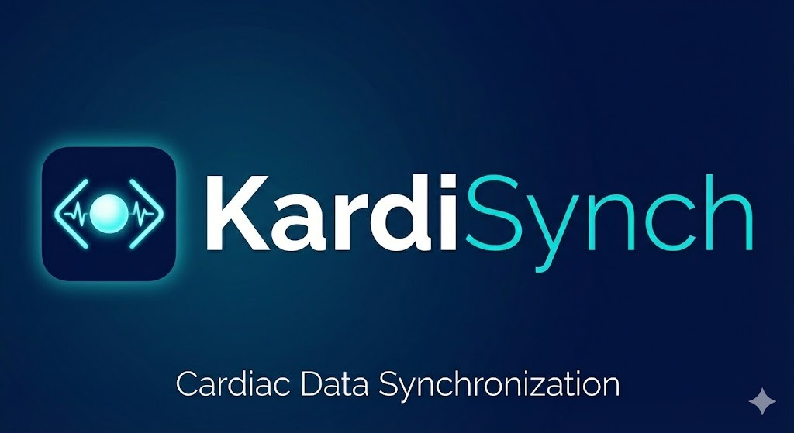

<p align="center">
  
</p>

<h1 align="center">KardiSynch</h1>

<p align="center">
  <strong>Desktop application for managing cardiac device interrogation reports</strong>
</p>

<p align="center">
  <a href="https://github.com/alexanderlanganke/KardiSynch/releases/latest"></a>
  
  <a href="https://github.com/alexanderlanganke/KardiSynch/blob/main/LICENSE"></a>
  
</p>

---

KardiSynch imports, parses, and organizes interrogation reports from all major cardiac implant manufacturers into one unified patient database. Drop files in, get structured data out — no server, no cloud, no setup.

## Who is this for?

- **Cardiac device clinics** managing interrogation follow-ups across multiple manufacturer ecosystems
- **Electrophysiology departments** that need a unified view of patient device history
- **Clinical engineers** working with reports from Medtronic, Biotronik, Boston Scientific, Abbott, and Microport

## Key Features

### Multi-Manufacturer Import

Automatically parses interrogation files from five manufacturers:

| Manufacturer | Supported Formats |
|---|---|
| **Medtronic** | PDF, XML (via `.pkg` archives), `.pdd` binary |
| **Biotronik** | XML, PDF |
| **Boston Scientific** | PDF, `.bnk` binary |
| **Abbott** | PDF, `.log` (DOCX) |
| **Microport** | XML |

Files are detected, parsed, and matched to patients automatically. Unmatched files trigger an interactive assignment dialog.

### Structured Patient Database

- Filesystem-based storage (`Reports/PatientID/VisitID/`) — portable, easy to back up, no database server needed
- SQLite index for fast search and filtering
- XML metadata files (`patient.xml`, `visit.xml`) generated per visit for interoperability
- Full-text search across patient names, device serials, and hospital IDs

### USB & Directory Monitoring

- Watches a configurable import directory for new files
- Optional USB source/target monitoring for direct device reader import
- File stability checks and copy verification prevent partial imports
- Only processes supported file types — ignores noise

### Clinical Data Extraction

Parsed data includes (where available in the source file):

- Patient demographics (name, DOB, hospital ID)
- Device identification (manufacturer, model, serial, type)
- Lead parameters (impedance, sensing, pacing threshold)
- Battery status (voltage, longevity, ERI/EOL indicators)
- Arrhythmia summaries (AF burden, VT episode counts)
- Interrogation metadata (date, session ID, hospital visit ID)

### Data Management Tools

- **Visit Timeline** — chronological view of all interrogations per patient
- **Side-by-Side Viewer** — original PDF alongside structured extracted data
- **Rescan Visit** — re-parse existing files with conflict resolution merge dialog
- **Move Visit** — reassign visits between patients
- **Device & Lead Editor** — manually edit device and lead history
- **Deduplication Tool** — finds and merges duplicate visits (database + filesystem level)
- **Database Rebuild** — full re-index from filesystem

### Manufacturer Advisory Links

Links to manufacturer advisory portals are surfaced directly on patient cards when applicable. KardiSynch does not determine advisory status — it provides direct links to official manufacturer resources for manual verification.

### MRI Compatibility Links

Quick-access links to manufacturer MRI compatibility check tools (Medtronic SureScan, Biotronik ProMRI, Abbott MerlinMRI, Boston Scientific ImageReady). MRI compatibility must always be verified by the responsible physician using official manufacturer resources.

## Installation

### Download

Get the latest installer for your platform from the [Releases page](https://github.com/alexanderlanganke/KardiSynch/releases/latest):

- **Windows**: `.exe` installer
- **macOS**: `.dmg` disk image
- **Linux**: `.AppImage`

### Quick Start

1. Launch KardiSynch
2. Configure your import directory in **Settings > Paths**
3. Drop interrogation files into the import directory
4. Open the dashboard — patients appear automatically as files are parsed

## Building from Source

Requires Node.js 22 LTS.

```bash
git clone https://github.com/alexanderlanganke/KardiSynch.git
cd KardiSynch
npm install
npm run build
npm run start
```

### Development

```bash
npm run dev          # Vite dev server (renderer, port 5173)
npm run build:main   # Build main process only
npm test             # Run unit tests (Vitest)
npm run test:e2e     # E2E tests (requires build first)
npm run package      # Build distributable packages
```

## Technology

| Layer | Stack |
|---|---|
| Runtime | [Electron 33](https://www.electronjs.org/) (Chromium + Node.js) |
| Frontend | [React 18](https://react.dev/), [Tailwind CSS v4](https://tailwindcss.com/), [Radix UI](https://www.radix-ui.com/) |
| Language | [TypeScript](https://www.typescriptlang.org/) |
| Database | SQLite (via `sqlite3`) — index only, source of truth is the filesystem |
| PDF | [PDF.js](https://mozilla.github.io/pdf.js/) |
| Build | [Vite](https://vite.dev/), [electron-builder](https://www.electron.build/) |
| CI/CD | GitHub Actions — automated builds on Windows, macOS, and Linux |

## Architecture

```
src/
├── main/              # Electron main process (Node.js)
│   ├── parsers/       # Per-manufacturer file parsers
│   ├── services/      # Background automation (MRI lookup, dedup, scraping)
│   ├── database.ts    # SQLite schema, queries, migrations
│   ├── storage.ts     # Filesystem operations, XML generation
│   ├── watcher.ts     # Import directory file watcher
│   └── usbWatcher.ts  # USB source/target polling
├── renderer/          # React SPA (Vite)
│   ├── components/    # UI components (shadcn/ui + custom)
│   └── utils/         # Client-side utilities
└── preload/           # Electron IPC bridge
```

All parsers produce a unified `UnifiedReport` object. The main process handles parsing, storage, and patient matching. The renderer is a standard React SPA communicating via IPC.

---

## Regulatory Notice

**KardiSynch is not a medical device and is not intended for clinical decision-making.**

This software is a data management and organizational tool. It does not provide medical advice, diagnoses, or treatment recommendations.

- **Patient data parsing** uses heuristic extraction from manufacturer files. Extracted data may contain errors and must not be used as the sole source of clinical information.
- **MRI compatibility** must be independently verified by the responsible physician using the manufacturer's official tools and documentation.
- **Device advisories** shown in this application link to manufacturer websites and may be incomplete or delayed. Always consult the manufacturer directly and relevant regulatory authorities for authoritative safety information.
- **Clinical decisions** regarding patient care, device programming, or procedural planning must be made by qualified healthcare professionals based on verified source data.

This software has not been certified, cleared, or approved under any medical device regulation (including EU MDR 2017/745, FDA 21 CFR 820, or equivalent). It is provided as-is for organizational purposes only.
