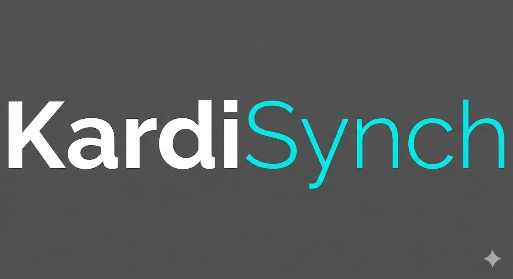

# KardiSynch
**Cardiac Data Synchronization & Management System**

KardiSynch is a modern, self-contained application designed to streamline the management and analysis of cardiac interrogation reports. Built with Electron, React, and TypeScript, it provides a seamless workflow for importing, parsing, and visualizing data from major device manufacturers including Medtronic, Biotronik, Boston Scientific, and Abbott.

<p align="center">
  
</p>

## 🚀 Features

### 📂 Filesystem-Based Data Access
- **No Database Server Required**: KardiSynch runs entirely from a local folder, making it portable and easy to deploy without administrative privileges.
- **Direct File Management**: Patient data is stored in a structured directory hierarchy (`Reports/PatientID/VisitID`), allowing for easy backup and external access.
- **XML Metadata**: Automatically generates `patient.xml` and `visit.xml` metadata files for interoperability.

### ⚡ Automated Ingestion
- **Smart Import**: Simply drop files into the `_IMPORT` directory. KardiSynch automatically detects, parses, and organizes them into the correct patient and visit folders.
- **Multi-Manufacturer Support**:
  - **Medtronic**: PDF and proprietary formats.
  - **Biotronik**: XML and PDF reports.
  - **Boston Scientific**: PDF and ZIP exports.
  - **Abbott**: PDF reports.

### 📊 Advanced Parsing & Visualization
- **PDF Intelligence**: Extracts patient demographics, device details, and interrogation dates directly from PDF reports using advanced regex patterns.
- **Timeline View**: Visualizes a patient's history with a chronological timeline of all visits.
- **Side-by-Side Comparison**: View the original PDF report alongside structured data for verification.

### 🎨 Modern UI
- **Dark Mode**: Sleek, dark-themed interface designed for low-light reading environments.
- **Responsive Design**: Glassmorphism effects and smooth animations for a premium user experience.

## 🛠️ Technology Stack

- **Core**: [Electron](https://www.electronjs.org/) (Chromium + Node.js)
- **Frontend**: [React](https://reactjs.org/), [Tailwind CSS](https://tailwindcss.com/)
- **Language**: [TypeScript](https://www.typescriptlang.org/)
- **Data**: Filesystem + SQLite (for fast indexing)
- **PDF Engine**: [PDF.js](https://mozilla.github.io/pdf.js/)

## 📦 Installation & Usage

1.  **Download**: Get the latest release (or build from source).
2.  **Run**: Double-click `KardiSynch.exe`. No installation required.
3.  **Import**: Copy your report files to the `_IMPORT` folder.
4.  **View**: Open the dashboard to see your patient list populated automatically.

## 🏗️ Building from Source

```bash
# Clone the repository
git clone https://github.com/alexanderlanganke/KardiSynch.git

# Install dependencies
npm install

# Run in development mode
npm run dev

# Build for production
npm run build
```

## 🔮 Planned Features

- [ ] **DICOM Integration**: Support for imaging data.
- [ ] **HL7 Export**: Interface with hospital EMR systems.
- [ ] **Cloud Sync**: Optional secure cloud backup.
- [ ] **AI Analysis**: Automated arrhythmia detection assistance.

---
*KardiSynch is a tool for data management and visualization. It is not a diagnostic device.*
